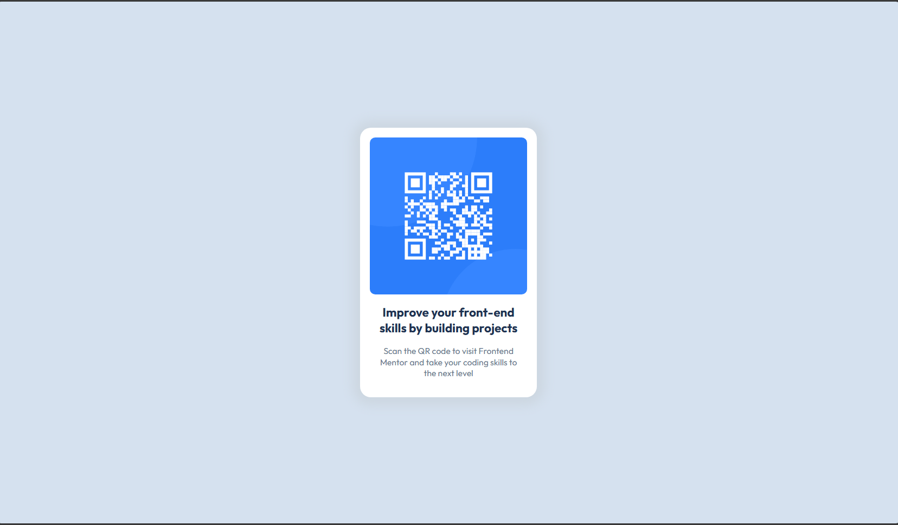
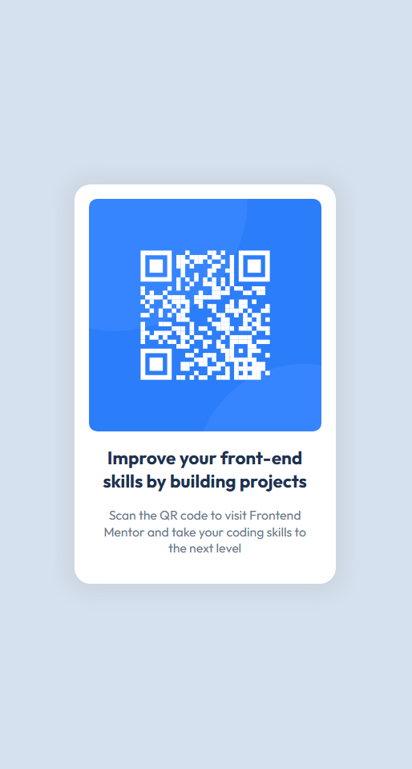

This is a basic html css project.

### Screenshot
- Desktop design

- Mobile design

### Links

- solution URL: [Solution URL](https://github.com/rizard1/qr-code-component-main)
- Live Site URL: [Live site URL](https://rizard1.github.io/qr-code-component-main/)

### Built with

- Semantic HTML5 markup
- CSS custom properties
- Flexbox
- CSS Grid
- Mobile-first workflow

## Author

- Frontend Mentor - [@rizard1](https://www.frontendmentor.io/profile/rizard1)
- Bluesky - [@rizard1.bsky.social](https://bsky.app/profile/rizard1.bsky.social)
